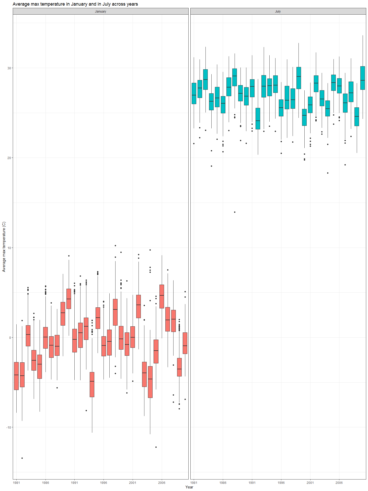
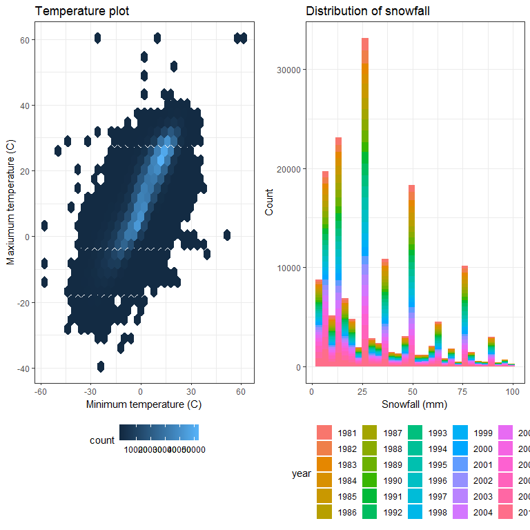

Homework 3
================

Problem 1
---------

load and clean the BRFSS data:

``` r
library(p8105.datasets)
data(brfss_smart2010)

brfss_data = 
  brfss_smart2010 %>% 
  janitor::clean_names() %>% 
  rename(state = locationabbr, county = locationdesc) %>% 
  filter(topic == "Overall Health") %>% 
  mutate(response = factor(response, levels = 
                             c("Excellent", "Very good", "Good", "Fair", "Poor")))
```

Answer the following questions:

a.In 2002, which states were observed at 7 locations?

``` r
brfss_data %>% 
  group_by(year, state) %>%
  summarize(n_county = n_distinct(county)) %>% 
  filter(year == 2002, n_county == 7)
```

    ## # A tibble: 3 x 3
    ## # Groups:   year [1]
    ##    year state n_county
    ##   <int> <chr>    <int>
    ## 1  2002 CT           7
    ## 2  2002 FL           7
    ## 3  2002 NC           7

From the result, we can see in 2002, CT, FL and NC were observed at 7 locations.

b.Make a “spaghetti plot” that shows the number of locations in each state from 2002 to 2010.

``` r
brfss_data %>% 
  group_by(year, state) %>%
  summarize(n_county = n_distinct(county)) %>% 
  ggplot(aes(x = year, y = n_county, color = state)) + 
    geom_line() + 
    labs(
      title = "Number of locations plot",
      x = "Year",
      y = "The number of locations in each state"
    ) +
    theme(legend.position = "right")
```


I used "ggplot() + geom\_point() + geom\_line()" to make the "spaghetti plot". The x axis shows the year from 2002 to 2010, and the y axis shows the number of locations in each state in each year. States are differentiated by different colors.

c.Make a table showing, for the years 2002, 2006, and 2010, the mean and standard deviation of the proportion of “Excellent” responses across locations in NY State.

``` r
brfss_data %>% 
  group_by(year) %>%
  filter(year %in% c(2002,2006,2010),
         state == "NY", response == "Excellent") %>% 
  summarize(mean_excellent = mean(data_value, na.rm = TRUE),
            sd_excellent = sd(data_value, na.rm = TRUE)) %>% 
  knitr::kable(digits = 1)
```

|  year|  mean\_excellent|  sd\_excellent|
|-----:|----------------:|--------------:|
|  2002|             24.0|            4.5|
|  2006|             22.5|            4.0|
|  2010|             22.7|            3.6|

The table shows the mean and standard deviation of the proportion of “Excellent” responses across locations in NY State for the years 2002, 2006, and 2010. We can see, the proportion of “Excellent” responses was highest in 2002, and were approximately equal in 2006 and 2010. The standard deviation of the proportion of “Excellent” responses across locations in NY State declined from 2002 to 2010, which means there were less variability with respect to the proportion of “Excellent” responses in years 2006 and 2010 than in year 2002.

d.For each year and state, compute the average proportion in each response category (taking the average across locations in a state). Make a five-panel plot that shows, for each response category separately, the distribution of these state-level averages over time.

``` r
response_average = 
  brfss_data %>% 
  group_by(year, state, response) %>%
  summarize(average = mean(data_value, na.rm = TRUE)) 
response_average
```

    ## # A tibble: 2,215 x 4
    ## # Groups:   year, state [?]
    ##     year state response  average
    ##    <int> <chr> <fct>       <dbl>
    ##  1  2002 AK    Excellent    27.9
    ##  2  2002 AK    Very good    33.7
    ##  3  2002 AK    Good         23.8
    ##  4  2002 AK    Fair          8.6
    ##  5  2002 AK    Poor          5.9
    ##  6  2002 AL    Excellent    18.5
    ##  7  2002 AL    Very good    30.9
    ##  8  2002 AL    Good         32.7
    ##  9  2002 AL    Fair         12.1
    ## 10  2002 AL    Poor          5.9
    ## # ... with 2,205 more rows

``` r
response_average %>% 
  ggplot(aes(x = year, y = average, color = state)) + 
     geom_line() + 
    facet_grid(~response) + 
    labs(
      title = "State-level averages vs year",
      x = "Year",
      y = "State-level averages") +
    theme(legend.position = "right")
```


I used "ggplot() + geom\_line()" because line plots are the most appropriate to show the distribution of the average proportion in each response category in each state over time. We can see from the plots that for all states the state-level average proportions in "Very good" were the highest while the state-level average proportions in "Poor" were the the lowest from 2002 to 2010.

Problem 2
---------

``` r
data(instacart)
head(instacart)
```

    ## # A tibble: 6 x 15
    ##   order_id product_id add_to_cart_ord~ reordered user_id eval_set
    ##      <int>      <int>            <int>     <int>   <int> <chr>   
    ## 1        1      49302                1         1  112108 train   
    ## 2        1      11109                2         1  112108 train   
    ## 3        1      10246                3         0  112108 train   
    ## 4        1      49683                4         0  112108 train   
    ## 5        1      43633                5         1  112108 train   
    ## 6        1      13176                6         0  112108 train   
    ## # ... with 9 more variables: order_number <int>, order_dow <int>,
    ## #   order_hour_of_day <int>, days_since_prior_order <int>,
    ## #   product_name <chr>, aisle_id <int>, department_id <int>, aisle <chr>,
    ## #   department <chr>

The dataset contains 1384617 observations of 131209 unique users, where each row in the dataset is a product from an order. There is a single order per user in this dataset.

There are 15 variables in this dataset:

order\_id: order identifier product\_id: product identifier add\_to\_cart\_order: order in which each product was added to cart reordered: 1 if this prodcut has been ordered by this user in the past, 0 otherwise user\_id: customer identifier eval\_set: which evaluation set this order belongs in order\_number: the order sequence number for this user (1 = first, n = nth) order\_dow: the day of the week on which the order was placed order\_hour\_of\_day: the hour of the day on which the order was placed days\_since\_prior\_order: days since the last order, capped at 30, NA if order\_number = 1 product\_name: name of the product aisle\_id: aisle identifier department\_id: department identifier aisle: the name of the aisle department: the name of the department

Answer the following questions:

a.How many aisles are there, and which aisles are the most items ordered from?

``` r
n_item = 
  instacart %>% 
  group_by(aisle) %>% 
  summarise(n_item = n()) %>% 
  arrange(desc(n_item))
head(n_item)
```

    ## # A tibble: 6 x 2
    ##   aisle                         n_item
    ##   <chr>                          <int>
    ## 1 fresh vegetables              150609
    ## 2 fresh fruits                  150473
    ## 3 packaged vegetables fruits     78493
    ## 4 yogurt                         55240
    ## 5 packaged cheese                41699
    ## 6 water seltzer sparkling water  36617

There are 134 aisles, the most items are ordered from "fresh vegetables" aisle.

b.Make a plot that shows the number of items ordered in each aisle. Order aisles sensibly, and organize your plot so others can read it.

``` r
knitr::opts_current$set(
  fig.width = 6,
  fig.asp = 2.6,
  out.width = "90%"
)

ID_1 = 
 instacart %>% 
    group_by(aisle_id) %>% 
    filter(aisle_id < 25) %>% 
    ggplot(aes(x = aisle_id)) + 
      geom_histogram() +
      labs(
        title = "Number of items vs aisle 
        (ID 1-24)",
        x = "Aisle ID",
        y = "Number of items"
      ) + 
      scale_x_continuous(
        breaks = c(0, 5, 10, 15, 20, 25)
    )

ID_2 = 
  instacart %>% 
    group_by(aisle_id) %>% 
    filter(aisle_id >= 25 & aisle_id < 50) %>% 
    ggplot(aes(x = aisle_id)) + 
      geom_histogram() +
      labs(
        title = "Number of items vs aisle 
        (ID 25-49)",
        x = "Aisle ID",
        y = "Number of items"
      ) + 
      scale_x_continuous(
        breaks = c(25, 30, 35, 40, 45, 50)
    )
  
ID_3 =
  instacart %>% 
    group_by(aisle_id) %>% 
    filter(aisle_id >= 50 & aisle_id < 75) %>% 
    ggplot(aes(x = aisle_id)) + 
      geom_histogram() +
      labs(
        title = "Number of items vs aisle 
        (ID 50-74)",
        x = "Aisle ID",
        y = "Number of items"
      ) + 
      scale_x_continuous(
        breaks = c(50, 55, 60, 65, 70, 75)
    )

ID_4 = 
  instacart %>% 
    group_by(aisle_id) %>% 
    filter(aisle_id >= 75 & aisle_id < 100) %>% 
    ggplot(aes(x = aisle_id)) + 
      geom_histogram() +
      labs(
        title = "Number of items vs aisle 
        (ID 75-99)",
        x = "Aisle ID",
        y = "Number of items"
      ) + 
      scale_x_continuous(
        breaks = c(75, 80, 85, 90, 95, 100)
    )

ID_5 = 
  instacart %>% 
    group_by(aisle_id) %>% 
    filter(aisle_id >= 100) %>% 
    ggplot(aes(x = aisle_id)) + 
      geom_histogram() +
      labs(
        title = "Number of items vs aisle 
        (ID 100-134)",
        x = "Aisle ID",
        y = "Number of items"
      ) + 
      scale_x_continuous(
        breaks = c(100, 110, 120, 130)
    )
library(patchwork)
(ID_1 + ID_2) / (ID_3 + ID_4) / ID_5
```

    ## `stat_bin()` using `bins = 30`. Pick better value with `binwidth`.
    ## `stat_bin()` using `bins = 30`. Pick better value with `binwidth`.
    ## `stat_bin()` using `bins = 30`. Pick better value with `binwidth`.
    ## `stat_bin()` using `bins = 30`. Pick better value with `binwidth`.
    ## `stat_bin()` using `bins = 30`. Pick better value with `binwidth`.

 Here I used histrogram plots because histogram is appropriate for showing the distribution of single variables

c.Make a table showing the most popular item in each of the aisles “baking ingredients”, “dog food care”, and “packaged vegetables fruits”.

``` r
instacart %>% 
  filter(aisle %in% c("baking ingredients", 
                      "dog food care", "packaged vegetables fruits")) %>% 
  group_by(aisle, product_name) %>% 
  summarise(n_item = n()) %>% 
  filter(min_rank(desc(n_item)) == 1) %>% 
  select(aisle, product_name) %>% 
  knitr::kable(digits = 1)
```

| aisle                      | product\_name                                 |
|:---------------------------|:----------------------------------------------|
| baking ingredients         | Light Brown Sugar                             |
| dog food care              | Snack Sticks Chicken & Rice Recipe Dog Treats |
| packaged vegetables fruits | Organic Baby Spinach                          |

d.Make a table showing the mean hour of the day at which Pink Lady Apples and Coffee Ice Cream are ordered on each day of the week; format this table for human readers (i.e. produce a 2 x 7 table).

``` r
instacart %>% 
  filter(product_name %in% c("Pink Lady Apples", "Coffee Ice Cream")) %>% 
  group_by(product_name, order_dow) %>% 
  summarise(mean_order_hour = mean(order_hour_of_day, na.rm = TRUE)) %>% 
  spread(key = order_dow, value = mean_order_hour) %>% 
  rename(Sunday = "0", Monday = "1", Tuesday = "2",
         Wednesday = "3", Thursday = "4", Friday = "5", 
         Saturday = "6") %>% 
  knitr::kable(digits = 1)
```

| product\_name    |  Sunday|  Monday|  Tuesday|  Wednesday|  Thursday|  Friday|  Saturday|
|:-----------------|-------:|-------:|--------:|----------:|---------:|-------:|---------:|
| Coffee Ice Cream |    13.8|    14.3|     15.4|       15.3|      15.2|    12.3|      13.8|
| Pink Lady Apples |    13.4|    11.4|     11.7|       14.2|      11.6|    12.8|      11.9|

Problem 3
---------

``` r
data(ny_noaa)
head(ny_noaa)
```

    ## # A tibble: 6 x 7
    ##   id          date        prcp  snow  snwd tmax  tmin 
    ##   <chr>       <date>     <int> <int> <int> <chr> <chr>
    ## 1 US1NYAB0001 2007-11-01    NA    NA    NA <NA>  <NA> 
    ## 2 US1NYAB0001 2007-11-02    NA    NA    NA <NA>  <NA> 
    ## 3 US1NYAB0001 2007-11-03    NA    NA    NA <NA>  <NA> 
    ## 4 US1NYAB0001 2007-11-04    NA    NA    NA <NA>  <NA> 
    ## 5 US1NYAB0001 2007-11-05    NA    NA    NA <NA>  <NA> 
    ## 6 US1NYAB0001 2007-11-06    NA    NA    NA <NA>  <NA>

The dimension (rows x columns) of the "ny\_noaa" dataset is 2595176, 7.
The "ny\_noaa" dataset contains 7 variables:
id: Weather station ID
date: Date of observation
prcp: Precipitation (tenths of mm)
snow: Snowfall (mm)
snwd: Snow depth (mm)
tmax: Maximum temperature (tenths of degrees C)
tmin: Minimum temperature (tenths of degrees C) Each weather station may collect only a subset of these variables, and therefore the resulting dataset contains extensive missing data.

Do or answer questions:

a.Do some data cleaning. Create separate variables for year, month, and day. Ensure observations for temperature, precipitation, and snowfall are given in reasonable units. For snowfall, what are the most commonly observed values? Why?

``` r
ny_clean = ny_noaa %>% 
  separate(date, into = c("year", "month", "day"), sep = "-") %>% 
  mutate(prcp = prcp / 10, tmin = as.numeric(tmin) / 10, 
         tmax = as.numeric(tmax) / 10) 

ny_clean %>% 
  group_by(snow) %>% 
  summarise(n_observed = n()) %>% 
  arrange(desc(n_observed))
```

    ## # A tibble: 282 x 2
    ##     snow n_observed
    ##    <int>      <int>
    ##  1     0    2008508
    ##  2    NA     381221
    ##  3    25      31022
    ##  4    13      23095
    ##  5    51      18274
    ##  6    76      10173
    ##  7     8       9962
    ##  8     5       9748
    ##  9    38       9197
    ## 10     3       8790
    ## # ... with 272 more rows

For snowfall, "0" is the most commonly observed value. That is because in most time of the year, there is no snowfall in New York.

b.Make a two-panel plot showing the average max temperature in January and in July in each station across years. Is there any observable / interpretable structure? Any outliers?

``` r
ny_clean %>%
  filter(month %in% c("01", "07")) %>% 
  group_by(id, month) %>% 
  summarise(mean_tmax = mean(tmax, na.rm = TRUE)) %>% 
  ggplot(aes(x = month, y = mean_tmax)) + 
     geom_boxplot() + 
     labs(
       title = "Average max temperature in January and in July",
       x = "Month",
       y = "Average max temperature")
```

    ## Warning: Removed 876 rows containing non-finite values (stat_boxplot).


c.Make a two-panel plot showing (i) tmax vs tmin for the full dataset; and (ii) make a plot showing the distribution of snowfall values greater than 0 and less than 100 separately by year.

``` r
tmax_tmin = 
  ggplot(ny_clean, aes(x = tmin, y = tmax)) + 
    geom_hex() + 
    labs(
       title = "Temperature plot",
       x = "Minimum temperature (C)",
       y = "Maxiumum temperature (C)"
    )

ny_clean %>%
  filter(snow > 0 & snow < 100) %>% 
  ggplot(aes(x = snow, fill = year)) + 
    geom_density(alpha = .4, adjust = .5, color = "blue") + 
    viridis::scale_color_viridis(
      name = "Year",
      discrete = TRUE
    ) 
```


``` r
snow_plot = 
  ny_clean %>%
  filter(snow > 0 & snow < 100) %>% 
  ggplot(aes(x = snow, fill = year)) +
    geom_histogram() +
    labs(
       title = "Distribution of snowfall",
       x = "Snowfall (mm)",
       y = "Count"
    )

tmax_tmin + snow_plot
```

    ## Warning: Removed 1136276 rows containing non-finite values (stat_binhex).

    ## `stat_bin()` using `bins = 30`. Pick better value with `binwidth`.


